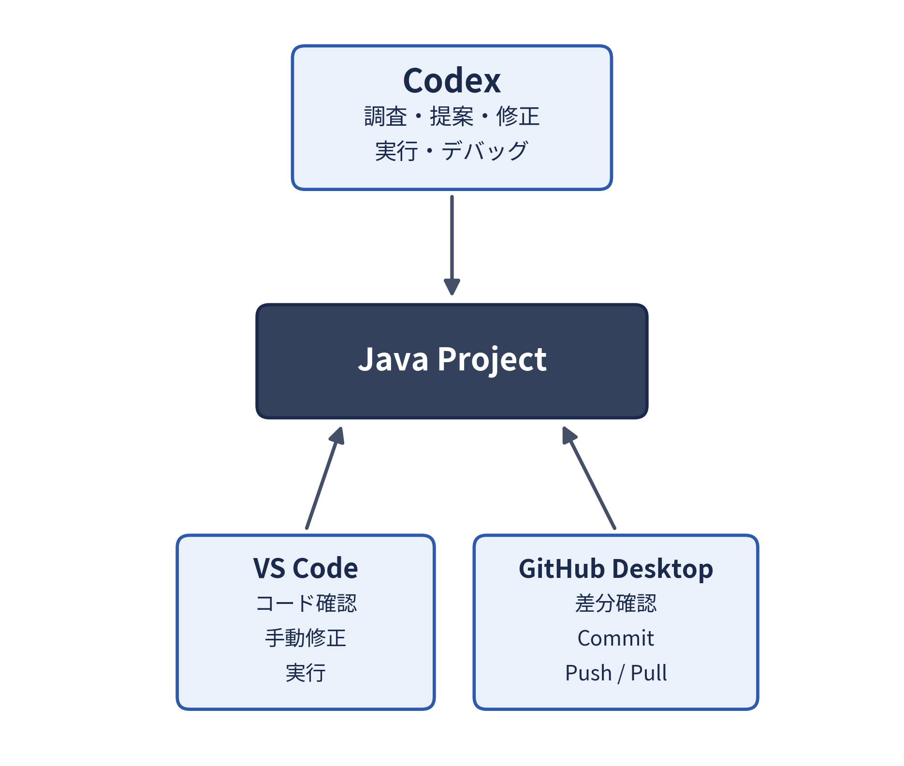

# Codex チュートリアル

## ― Javaプログラム開発でCodexを使ってみる ―

------------------------------------------------------------------------

# Part 0：概要

## 0-1. このチュートリアルの目的

このチュートリアルでは、**Codexを卒業研究におけるプログラム開発支援に利用するための基本的な使い方**を学びます。

今回は、以前のチュートリアルで使用した `java-llm-samples`
を題材にします。

-   サンプルプログラム\
    <https://github.com/oecu-kozaki-lab/java-llm-samples>

以前のチュートリアルでは、**JavaプログラムからOpenAI
APIを利用してLLMを呼び出す方法**を学びました。

今回は逆に、**Codexを使ってJavaプログラムを理解・修正・実行・デバッグする方法**を学びます。

### 到達目標

このチュートリアル終了時に、次のことができることを目標とします。

1.  Codexアプリをインストールし、OpenAI APIを利用できるように設定する
2.  Codexで既存のJavaプロジェクトを開く
3.  Codexを使って既存コードの構成や処理内容を調査する
4.  Codexを使ってJavaコードを修正する
5.  Codexを使って機能追加を行う
6.  Codexを使ってプログラムを実行し、エラーの原因を調査する
7.  VS Code、Codex、GitHub Desktopを適切に使い分ける

------------------------------------------------------------------------

## 0-2. Codexとは

Codexは、プログラム開発を支援するAIエージェントです。

ChatGPTにコードを貼り付けて質問するだけでなく、**開発プロジェクト内の複数のファイルを読み、コードを調査・変更し、必要に応じてコマンドを実行しながら作業を進める**ことができます。

> **注意（名称について）**
>
> 「Codex」という名称は、2021年にOpenAIが発表したコード生成モデル（現在は提供終了）を指す場合と、2025年以降に登場したエージェント型の開発支援ツールを指す場合があります。\
> 本チュートリアルで扱う「Codex」は、後者のエージェント型開発支援ツール（Codexアプリ／CLI）です。Web検索で調べる際は、古い情報と混同しないよう注意してください。

### ChatGPTとCodexの使い方の違い

| ChatGPT | Codex |
| --- | --- |
| 質問・相談する | 開発作業を依頼する |
| 必要なコードを会話に入力する | プロジェクト内のファイルを直接調査する |
| コード例を生成してもらう | 実際のファイルを変更してもらう |
| エラー内容について相談する | プログラムを実行してエラーを調査してもらう |
| 会話が中心 | 開発作業が中心 |

このチュートリアルでは、Codexを単なる「コード生成AI」としてではなく、

> **既存のプログラムを調査し、修正し、動作確認する開発支援AI**

として利用します。

------------------------------------------------------------------------

## 0-3. 今回使用する開発環境

このチュートリアルでは、以下の環境が導入済みであることを前提とします。

-   Windows
-   VS Code
-   Java開発環境
-   GitHub Desktop
-   Git
-   `java-llm-samples`
-   OpenAI APIを利用するためのAPIキー

それぞれの役割は次の通りです。

| ツール | 主な役割 |
| --- | --- |
| VS Code | Javaコードの確認・編集・実行 |
| Codex | コードの調査・変更・実行・デバッグ支援 |
| GitHub Desktop | 変更差分の確認、Commit、Push、Pull |
| GitHub | ソースコードの共有・管理 |
| OpenAI API | CodexやサンプルプログラムからOpenAIのモデルを利用 |

基本的には、次のように使い分けます。



------------------------------------------------------------------------

# Part 1：Codexを使う準備

## 1-1. Codexアプリのインストール

Codexアプリを公式サイトからダウンロードし、インストールします。

### 作業

1.  OpenAIのCodex公式ページ（<https://chatgpt.com/codex/>）を開く
2.  使用しているOSに対応したCodexアプリをダウンロードする
3.  ダウンロードしたインストーラを実行する
4.  Codexを起動する

> **注意**
>
> Codexは更新によって画面や設定方法が変更される場合があります。\
> チュートリアル時には、教員から指示された最新の手順に従ってください。

------------------------------------------------------------------------

## 1-2. OpenAI APIの設定

今回のチュートリアルでは、OpenAI APIを利用してCodexを使用します。

Codexは、ChatGPT Plus/Pro/Business/Eduなどの有料ChatGPTアカウントでログインして利用することもできます。しかし、研究室の学生全員が有料ChatGPTアカウントを持っているわけではないため、本チュートリアルでは、**研究室から学生一人一人に配布されているOpenAI
APIキー**を使ってCodexを利用する方法を採用します。有料ChatGPTアカウントを持っている場合でも、このチュートリアルでは配布されたAPIキーを使う方法で統一してください。

概念的には次のような関係になります。

``` text
Codex
  │
  ↓
OpenAI API
  │
  ↓
OpenAIのモデル
```

教員（研究室）から配布された自分専用のAPIキーを使って、CodexからOpenAI
APIを利用できる状態に設定してください。

### CodexとJavaプログラム、それぞれのAPIキー設定の違い

Codexの設定でAPIキーを登録しても、それはあくまで**Codexというツール自体**がOpenAIのモデルを呼び出すための設定です。

`java-llm-samples`のJavaプログラム自体も、実行時に別途APIキーを読み込む設定（以前のチュートリアルで設定した`config.properties`など）を必要とします。

同じAPIキーの値を使う場合でも、**設定する場所（Codex側の設定と、Javaプログラム側の設定ファイル）は別**です。Codex側の設定を済ませただけではJavaプログラム側の設定が済んでいないと、サンプルプログラムを実行してもAPIキーが見つからずエラーになります。両方が正しく設定されているか、それぞれ確認してください。

### APIキーの取り扱い

APIキーはパスワードと同じように扱ってください。

**次のような使い方は禁止します。**

-   JavaソースコードにAPIキーを直接書く
-   APIキーをGitHubにPushする
-   READMEなどの公開ファイルにAPIキーを書く
-   APIキーを他人に送る
-   APIキーを含む設定ファイルを誤ってCommitする

APIキーを含むファイルを使用する場合は、`.gitignore`
の設定も確認してください。

### Codexの動作モード（承認・サンドボックス設定）を確認する

Codexには、ファイルの変更やコマンドの実行をどこまで自動的に行ってよいかを制御する**動作モード（承認モード／サンドボックス設定）**があります。

一般的には、次のようなモードが用意されています（名称やUIはバージョンによって異なります）。

-   **要承認モード**：ファイルの変更やコマンドの実行を行う前に、必ず人間の承認を求める
-   **自動編集モード**：ファイルの編集は自動で行うが、コマンドの実行には承認を求める
-   **フルオートモード**：ファイルの変更・コマンドの実行を、承認なしに自動で行う

> **重要**
>
> このチュートリアルでは「まだコードは変更しないでください」という指示を繰り返し使いますが、これはあくまで**Codexへのプロンプト上の指示**です。Codexの動作モードがフルオートになっていると、この指示が徹底されず、ファイルが変更されてしまう可能性があります。\
> 調査や提案だけを依頼する演習（演習1、演習2、演習4の前半など）では、Codexの動作モードを**要承認モード（変更前に必ず確認を求めるモード）**に設定しておくことを推奨します。\
> 提案内容を確認し、実装を依頼する段階になったら、必要に応じてモードを変更してください。\
> 設定箇所や名称は更新により変わる可能性があるため、最新のCodexの設定画面で確認するか、教員に確認してください。

------------------------------------------------------------------------

# Part 2：Codexで既存プログラムを調べる

## 2-1. サンプルプロジェクトを準備する

今回使用するプロジェクトは以下です。

<https://github.com/oecu-kozaki-lab/java-llm-samples>

以前のチュートリアルで使用したローカルのプロジェクトを利用しても構いません。

必要に応じてGitHub Desktopを使って最新版を取得してください。

### 作業前の確認

1.  GitHub Desktopで対象リポジトリを確認する
2.  必要に応じてPullする
3.  VS Codeでプロジェクトを開く
4.  サンプルプログラムが実行できることを確認する

**Codexで変更を始める前に、元のプログラムが正常に動作することを確認しておくことが重要です。**

------------------------------------------------------------------------

## 2-2. Codexでプロジェクトを開く

Codexから `java-llm-samples` のローカルフォルダを開きます。

Codexがプロジェクト内のJavaファイルを参照できることを確認してください。

------------------------------------------------------------------------

# 演習1：プロジェクト全体を調査する

## 2-3. Codexにプロジェクトを説明させる

まず、Codexにコードを書かせるのではなく、既存プロジェクトを調査させます。

Codexに次のように指示してください。

> このプロジェクト全体を調べてください。\
> どのような目的のプロジェクトか説明してください。\
> また、主要なJavaファイルについて、それぞれの役割を説明してください。\
> まだファイルは変更しないでください。

### 確認すること

Codexの回答について、以下を確認してください。

-   プロジェクトの目的を正しく説明しているか
-   主要なJavaファイルを見つけているか
-   各ファイルの役割を正しく説明しているか
-   自分が以前のチュートリアルで理解した内容と一致しているか

### ポイント

Codexの説明が必ず正しいとは限りません。

> **Codexの回答と、自分が知っているプログラムの内容を比較する**

ことも重要な作業です。

------------------------------------------------------------------------

# 演習2：特定の処理を調査する

## 2-4. `langchain4j_Chat.java` を調査する

次に、特定のJavaファイルについて詳しく調査します。

Codexに次のように指示してください。

> `langchain4j_Chat.java`について調べてください。\
> 次の4点について、該当するコードを示しながら説明してください。
>
> 1.  APIキーをどこから取得しているか\
> 2.  使用するLLMモデルをどこで指定しているか\
> 3.  LLMに送るプロンプトをどこで指定しているか\
> 4.  LLMから得られた回答をどこで処理しているか
>
> コードは変更しないでください。

続いて、次のように指示します。

> `langchain4j_Chat.java`からOpenAI
> APIが呼び出され、結果が画面に表示されるまでの処理の流れを順番に説明してください。

### この演習の目的

卒業研究では、

-   自分が以前に書いたコード
-   他の学生が書いたコード
-   GitHubから取得したコード

などを読んで理解する必要があります。

Codexは、**既存コードを調査するための支援ツール**として利用できます。

------------------------------------------------------------------------

# Part 3：Codexにプログラムを変更させる

# 演習3：小さな変更を行う

## 3-1. `langchain4j_TextFile.java` を変更する

次はCodexに実際のコードを変更させます。

対象：

``` text
langchain4j_TextFile.java
```

まず、現在の処理を確認します。

> `langchain4j_TextFile.java`の処理内容を説明してください。\
> 特に、入力ファイルの読み込み、LLMへの問い合わせ、結果の出力について説明してください。\
> まだ変更しないでください。

内容を確認したら、次の変更を依頼します。

> `langchain4j_TextFile.java`を修正して、LLMから得られた回答をコンソールに表示するだけでなく、`result.txt`にも保存してください。

------------------------------------------------------------------------

## 3-2. Codexが変更したコードを確認する

Codexが変更したら、それで作業終了ではありません。

> **補足：Codexアプリ自体にも差分確認機能があります**
>
> Codexアプリには、変更差分を確認できる「Review」機能（差分パネル）が用意されています。画面右上の「差分パネルを切り替える」から表示でき、「Last turn changes」に切り替えれば直前のやり取りでCodexが加えた変更だけに絞って確認できます。差分はファイル単位・hunk単位で反映（stage）や取り消し（revert）もでき、CLI版では`/diff`コマンドでも同様に確認できます。\
> ただし、このチュートリアルでは、Codex自身の画面だけで完結させず、**VS CodeとGitHub Desktopという別のツールでも独立して確認する**ことを推奨します。Codexの差分表示はバージョンによって表示されない・エラーになるなどの不具合が報告されることもあるため、GitHub Desktopでの確認は「念のためのダブルチェック」として重要です。

次の順序で確認してください。

### 1. VS Codeで確認

変更されたJavaコードを開きます。

確認するポイント：

-   どのコードが追加されたか
-   既存コードが不要に変更されていないか
-   ファイルへの出力処理がどのように実装されたか

### 2. プログラムを実行

VS CodeまたはCodexからプログラムを実行します。

### 3. 出力を確認

`result.txt` が作成され、LLMの回答が保存されていることを確認します。

`result.txt` が作成される場所は、実行方法によって異なります（多くの場合、Javaプログラムを実行したときの作業ディレクトリを基準に作成されます）。見つからない場合は、プロジェクトのルートフォルダや、実行に使ったフォルダを確認してください。

### 4. GitHub Desktopで確認

GitHub Desktopの `Changes` を確認します。

**Codexがどのファイルのどの部分を変更したかを必ず確認してください。**

------------------------------------------------------------------------

# 演習4：仕様を与えて機能を追加する

## 3-3. 少し複雑な機能追加

次は、次の仕様を実現します。

### 追加する機能

このチュートリアルのリポジトリで配布している `exercise4_input.txt` を1行ずつ読み込み、空行以外の各行についてLLMに問い合わせます。

> `exercise4_input.txt` は、`java-llm-samples` にもとから含まれる `input.txt` とは別のファイルです。本チュートリアルのリポジトリの `materials/exercise4_input.txt` をダウンロードし、`java-llm-samples` プロジェクトのフォルダに配置してください。

LLMへの問い合わせでは、各行の文章を読み取った内容を**「主語-述語-目的語」のトリプル形式**で出力するよう指示します。

結果は `triples.tsv` に保存します。

出力する内容：

``` text
入力文章<TAB>主語-述語-目的語
```

文字コードはUTF-8とします。

> **注意**
>
> `exercise4_input.txt`の行数が多いと、LLMへの問い合わせ回数もその分増えます。APIキーはOpenAIの利用量に応じて課金されるため、行数や実行回数に応じて**費用と実行時間がかかる**ことを意識してください。\
> 動作確認は、まず数行程度の小さな`exercise4_input.txt`で行うことを推奨します。

------------------------------------------------------------------------

## 3-4. いきなり実装させない

今回は、すぐに「実装してください」と指示しません。

まずCodexに実装方法を考えさせます。

> `langchain4j_TextFile.java`を次の仕様に変更したいです。
>
> -   `input.txt`ではなく`exercise4_input.txt`を1行ずつ読み込む
> -   空行は処理しない
> -   各行の文章について、LLMに「主語-述語-目的語」のトリプル形式で出力するよう問い合わせる
> -   入力した文章とLLMの回答（トリプル）を`triples.tsv`にTSV形式で保存する
> -   文字コードはUTF-8とする
>
> この仕様を実現するために、現在のプログラムのどこを変更する必要があるか調べ、実装方法を説明してください。\
> **まだコードは変更しないでください。**

Codexの提案を読んでください。

### 確認すること

-   仕様を正しく理解しているか
-   変更する場所は適切か
-   不要な変更を提案していないか
-   Javaの処理として妥当か

------------------------------------------------------------------------

## 3-5. 実装を依頼する

提案内容に問題がなければ、

> その方法で実装してください。

と指示します。

実装後、さらに、

> 実装した内容を説明してください。\
> 特に、元のプログラムから変更した箇所を説明してください。

と指示してください。

その後、

1.  VS Codeでコードを確認
2.  プログラムを実行
3.  `triples.tsv`を確認
4.  GitHub Desktopで変更差分を確認

します。

------------------------------------------------------------------------

# Part 4：Codexを使ってデバッグする

# 演習5：エラーの原因を調査する

## 4-1. バグを含むプログラムを実行する

本チュートリアルでは、意図的にバグを含めた `langchain4j_Buggy.java` を使用します（教員から別のプログラムを指定された場合は、そちらを使用してください）。

> `langchain4j_Buggy.java` と、その実行に使う `exercise5_input.txt` は、本チュートリアルのリポジトリの `materials` フォルダで配布しています。\
> `langchain4j_Buggy.java` は `java-llm-samples` プロジェクトの `langchain4j-samples/src/main/java/jp/kozaki/lab/` フォルダに、`exercise5_input.txt` は `config.properties` と同じ階層（プロジェクトのルートフォルダ）に配置してください。

まずCodexに次のように指示します。

> このプログラムを実行してください。\
> エラーが発生した場合は、その原因を調査して説明してください。\
> **まだコードは修正しないでください。**

### ポイント

ここでも、

``` text
エラー発生
    ↓
すぐに修正
```

とはしません。

まず、

``` text
エラー発生
    ↓
エラー内容を確認
    ↓
原因を調査
    ↓
原因の説明を確認
    ↓
修正
```

という手順を取ります。

------------------------------------------------------------------------

## 4-2. Codexに修正させる

Codexが説明した原因が妥当であることを確認してから、

> 原因を修正してください。\
> 修正後にもう一度プログラムを実行し、正常に動作することを確認してください。

と指示します。

修正後はVS CodeとGitHub Desktopでも変更内容を確認してください。

------------------------------------------------------------------------

# Part 5：Codexへの指示の出し方

## 5-1. 大きな作業を一度に依頼しない

### あまり良くない例

> このプログラムを完成させて。

このような指示では、

-   何を完成とするのか分からない
-   Codexが大規模な変更を行う可能性がある
-   変更内容を人間が確認しにくい

という問題があります。

### 推奨する方法

作業を小さな段階に分けます。

``` text
① 調査
   ↓
② 実装方法の提案
   ↓
③ 人間が確認
   ↓
④ 実装
   ↓
⑤ 実行・テスト
   ↓
⑥ コード確認
   ↓
⑦ Gitの差分確認
```

例えば、

> このプロジェクトのデータ読み込み処理がどこにあるか調べてください。\
> まだ変更しないでください。

↓

> TSVファイルにも対応したいです。実装方法を提案してください。\
> まだ変更しないでください。

↓

> その方法で実装してください。

↓

> テストを実行してください。

というように進めます。

------------------------------------------------------------------------

## 5-2. 「まだ変更しないでください」を活用する

Codexに調査や設計を依頼するときは、

> **まだコードは変更しないでください。**

と明示すると便利です。

卒業研究では、Codexにすぐ実装させるのではなく、

1.  現状を調査させる
2.  方法を提案させる
3.  自分で内容を判断する
4.  問題なければ実装させる

という使い方を基本にしてください。

------------------------------------------------------------------------

# Part 6：VS Code・Codex・GitHub Desktopの使い分け

## 6-1. Codexだけで開発を完結させない

Codexでプログラムを変更できるからといって、すべての作業をCodexだけで行う必要はありません。

### Codex

主に次の作業に利用します。

-   プロジェクト構造の調査
-   コードの説明
-   処理箇所の検索
-   実装方法の提案
-   コード変更
-   リファクタリング
-   プログラム実行
-   エラー調査
-   テスト作成
-   変更差分の確認（Review機能／差分パネル）

> Codexアプリ自体にも差分確認機能（Review機能）があるため、変更内容の確認はCodexの画面だけでも一応完結します。しかし、このチュートリアルでは、Codexとは独立したツールであるVS CodeとGitHub Desktopでも重ねて確認することを基本とします。

### VS Code

主に次の作業に利用します。

-   ソースコードを読む
-   Codexが変更したコードを確認する
-   必要に応じて自分で修正する
-   Javaプログラムを実行する

### GitHub Desktop

主に次の作業に利用します。

-   変更されたファイルを確認する
-   差分（diff）を確認する
-   Commitする
-   Push/Pullする

------------------------------------------------------------------------

## 6-2. 推奨する開発サイクル

卒業研究でCodexを利用するときは、次のサイクルを基本としてください。

``` text
① Codexに調べてもらう
        ↓
② 方法を提案してもらう
        ↓
③ 自分で提案内容を確認する
        ↓
④ Codexに実装してもらう
        ↓
⑤ 実行・テストする
        ↓
⑥ VS Codeでコードを確認する
        ↓
⑦ GitHub Desktopで差分を確認する
        ↓
⑧ Commitする
```

**Codexがコードを生成した時点では、作業は終了していません。**

------------------------------------------------------------------------

# Part 7：卒業研究での利用例

## 7-1. 既存コードを理解する

例えば、

> このプロジェクトでRDFを生成している処理を探してください。\
> 処理の流れも説明してください。\
> まだ変更しないでください。

------------------------------------------------------------------------

## 7-2. OpenAI APIを利用している箇所を調査する

> OpenAI APIを呼び出している箇所をすべて探してください。\
> それぞれ、どのモデルを使用し、どのようなデータを送信しているか説明してください。

------------------------------------------------------------------------

## 7-3. SPARQLの問題を調査する

> このSPARQLクエリを実行すると結果が0件になります。\
> 関連するRDFデータとクエリを調べ、考えられる原因を説明してください。\
> まだ変更しないでください。

------------------------------------------------------------------------

## 7-4. リファクタリングを相談する

> このクラスが大きくなってきました。\
> 現在のクラスの責務を分析し、クラスを分割するとしたらどのような構成がよいか提案してください。\
> まだコードは変更しないでください。

------------------------------------------------------------------------

## 7-5. テストを作成する

> このメソッドについて、正常系と代表的な異常系を確認するJUnitテストを提案してください。

内容を確認してから、

> 提案したテストを実装してください。

と依頼します。

------------------------------------------------------------------------

# Part 8：発展演習

## 8-1. 自分で機能を考えて追加する

`java-llm-samples`
のプログラムを1つ選び、Codexを利用して新しい機能を1つ追加してください。

例えば、

-   出力をCSV/TSV/JSON形式にする
-   プロンプトを外部ファイルから読み込む
-   複数の入力を一括処理する
-   モデル名を設定ファイルから変更できるようにする
-   実行時間を計測する
-   APIへの問い合わせ回数を表示する
-   例外処理を改善する
-   PDFを処理するプログラムを拡張する
-   画像を処理するプログラムを拡張する

などが考えられます。

### 発展演習で行うこと

1.  追加したい機能を決める
2.  Codexに既存コードを調査させる
3.  Codexに実装方法を提案させる
4.  提案内容を自分で確認する
5.  Codexに実装させる
6.  動作確認する
7.  VS Codeでコードを確認する
8.  GitHub Desktopで差分を確認する

------------------------------------------------------------------------

# Part 9：Codexを研究で利用するときの注意事項

## 9-1. Codexの回答を正しいと思い込まない

Codexは間違った説明やコードを生成することがあります。

必ず、

-   コード
-   実行結果
-   入出力
-   使用しているライブラリ
-   APIの仕様

などを確認してください。

------------------------------------------------------------------------

## 9-2. 「動いた」だけで正しいと判断しない

プログラムが正常終了しても、

-   意図した処理になっていない
-   データの解釈が間違っている
-   評価方法が適切でない
-   一部のデータだけで偶然動いている

可能性があります。

特に卒業研究では、

> **プログラムとして動くことと、研究として正しいことは別**

です。

------------------------------------------------------------------------

## 9-3. 研究上の判断をCodex任せにしない

Codexに相談することは構いません。

例えば、

> この評価方法にはどのような問題が考えられますか。

と質問して検討材料を得ることはできます。

しかし、

-   研究目的
-   研究手法
-   実験条件
-   評価方法
-   結果の解釈
-   結論

についての最終的な判断は、自分自身で行ってください。

必要に応じて指導教員と相談してください。

------------------------------------------------------------------------

## 9-4. APIキーを公開しない

APIキーは絶対にGitHubなどに公開しないでください。

Commitする前にGitHub DesktopのChangesを確認し、

-   APIキー
-   パスワード
-   個人情報
-   公開してはいけないデータ

が含まれていないことを確認してください。

------------------------------------------------------------------------

# まとめ

## Codexを使う基本サイクル

``` text
調べる
  ↓
提案してもらう
  ↓
自分で確認する
  ↓
実装してもらう
  ↓
実行・テストする
  ↓
コードを確認する
  ↓
Gitの差分を確認する
  ↓
Commit
```

Codexの目的は、

> **「自分の代わりに卒業研究のプログラムを書いてもらう」ことではありません。**

Codexを、

> **プログラムを理解し、設計を検討し、実装し、デバッグする作業を支援するAIエージェント**

として活用してください。

最終的に、

-   何を実装するのか
-   なぜその実装でよいのか
-   Codexが何を変更したのか
-   そのプログラムが正しく動いているのか

を**自分自身で説明できること**が重要です。
